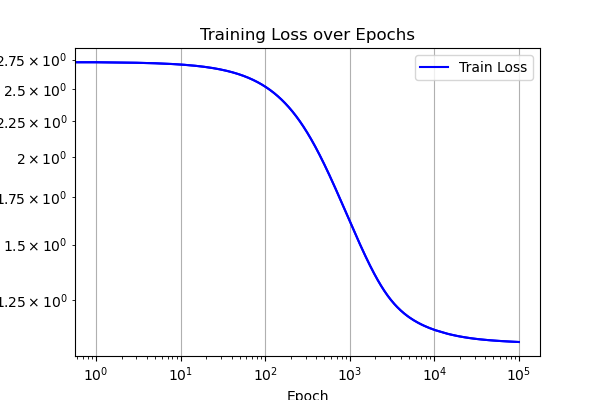
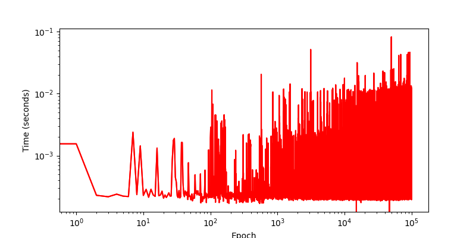

# Distributed Data Parallel Machine Learning

This project is done as an implementation of MPI, OpenMP, and end-to-end machine learning training implemented from pure math without any external libraries. 

This program uses the [wine quality dataset](https://www.kaggle.com/datasets/uciml/red-wine-quality-cortez-et-al-2009) from UC-Irive Machine Learning. 

for a walkthrough of the code, check out the [powerpoint presentation](https://docs.google.com/presentation/d/1KVtCP7QzkAJUpX0EUnr75AU-cepmenrGgdAyb3Ky7v0/edit?usp=sharing)

# Model

The problem is broken down into a mutliclassification problem, where each wine is categorized into its quality 'group' 0-10. This enables using a Multinomial Logisitic Regressor; predicting a probability distribution of a wine belonging to a given class.

$$
\begin{align}
\mathbf{x}  & = [7, 0.27, 0.36, 20.7, 0.045, 45, 170, 1.001, 3, 0.45, 8.8] & y = 6 \\
\mathbf{x}_{i}  & = [1, x_{1},x_{2},\dots,x_{N}] 
\end{align}
$$
$$
\mathbf{X} = \begin{bmatrix}
\mathbf{x}_{1} \\
\mathbf{x}_{2} \\
\dots \\
\mathbf{x}_{D} \\
\end{bmatrix} = \begin{bmatrix}
 & x_{1,1}  & x_{1,2}  & \dots  & x_{1, N} \\
 & x_{2,1}  & x_{2,2}  & \dots  & x_{2, N} \\
 & \dots  & \dots & \dots & \dots\\
 & x_{D,1} &  x_{D,2}  & \dots  & x_{D, N} \\
\end{bmatrix}
$$
$$
\mathbf{w} = [1, w_{1}, w_{2}, \dots, w_{N}]
$$
$$
\hat{y} = \theta(\mathbf{w}^{T}\mathbf{x})
$$

where $\theta$ is the sigmoid function:

$$
\theta= \frac{e^{x}}{1+e^{x}}
$$

However, multinomial log regression utilizes the softmax instead of a sigmoid to normalize each predicted probability:

$$
\hat{y}_{j} =
\begin{align}
z_{1} = w_{1}^Tx \\
z_{2} = w_{2}^Tx \\
\dots \\
z_{K} = w_{K}^Tx \\ 
\end{align} = \frac{e^{z_{j}}}{\sum_{i=1}^Ke^{z_{i}}}
$$
$$
Y = \begin{bmatrix}
z_{1,1} & z_{1,2} & \dots & z_{1,K} \\
z_{2,1} & z_{2,2} & \dots & z_{2,K} \\
\dots & \dots & \dots & \dots \\
z_{D, 1} & \dots & \dots & z_{D,K}
\end{bmatrix}
$$

with the loss function of cross-entropy:

$$
E_{in}(\mathbf{w}) = \frac{1}{N}\sum_{n=1}^N \ln(1+e^{-y_{n}\mathbf{w}^{T}\mathbf{x}_{n}})
$$

and a gradient 

$$
\nabla E_{in}(\mathbf{w}) = \frac{1}{N}\sum_{n=1}^N -y_{n}\mathbf{x}_{n} \theta(-y_{n}\mathbf{w}^{T}\mathbf{x}_{n})
$$

tested with the following HPs
- LR 0.005
- EP 1e-7
- EPOCHS 100,000

On Iowa State's HPC Nova Cluster:
- 2 nodes : 128 cores 

